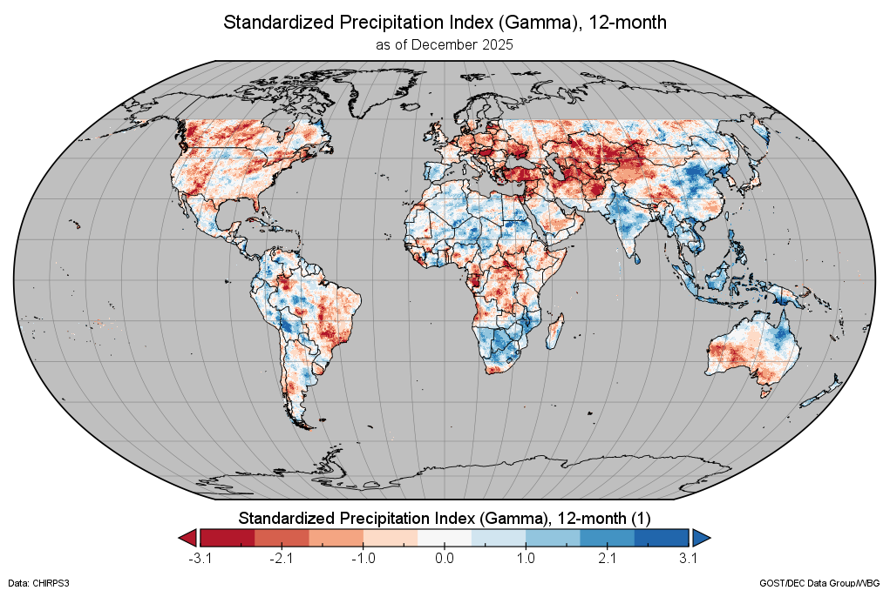
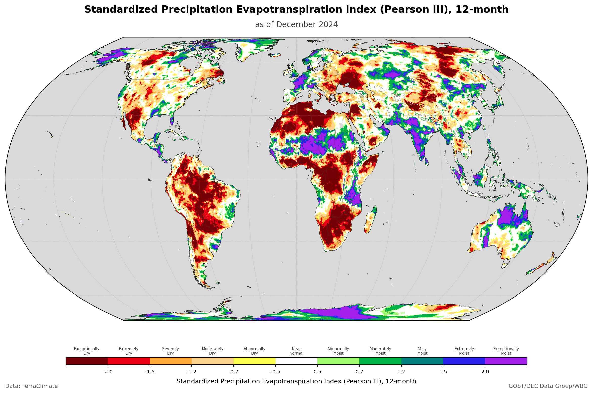

# Precipitation Index - SPI & SPEI for Climate Extremes Monitoring


</br>

**precip-index** is a Python toolkit for calculating precipitation-based climate indices (SPI and SPEI) and analyzing **dry and wet extremes** using **run theory**, designed for gridded `xarray` workflows at global scale.

📚 Documentation: https://bennyistanto.github.io/precip-index/

## This Fork: GPU Acceleration + Global Pipeline

This repository adapts the original [World Bank precip-index](https://github.com/bennyistanto/precip-index) to run efficiently on GPU hardware for global-scale TerraClimate datasets, and adds a probability layer output and validation workflow.

**What was added on top of the original code:**

| Component | File | Description |
|-----------|------|-------------|
| GPU acceleration | `src/gpu.py` | CuPy-based GPU replacements for rolling sum, gamma fitting, and normal transform — all three bottlenecks in SPI/SPEI computation |
| GPU-enabled compute | `src/compute.py`, `src/indices.py`, `src/chunked.py` | Modified to call GPU functions when CuPy is available, with transparent CPU fallback |
| Data download | `download_terraclimate.py` | Download and validate TerraClimate per-year NetCDF files (ppt, pet, tmax, tmin) with resume support |
| Zarr conversion | `convert_to_zarr.py` | Convert per-year NetCDF files to Zarr stores for fast chunked I/O |
| Global SPI/SPEI runner | `run_spi.py`, `run_spei.py` | End-to-end pipeline: reads Zarr or NetCDF, computes SPI/SPEI in GPU-accelerated spatial chunks, writes CF-compliant NetCDF |
| Probability layer | `compute_prob_geotiff.py` | Computes per-pixel exceedance probabilities (P(SPI ≤ -1.0/-1.5/-2.0)) and data quality flags from full time series; writes 4-band Cloud-Optimised GeoTIFF |
| Validation | `compare_bali_old_data.py` | Compares new GPU-computed SPI/SPEI against original author's Bali reference output (correlation, RMSE, bias maps) |
| Colab notebook | `colab/SPI_colab.ipynb` | End-to-end SPI pipeline running on Google Colab A100 GPU |
| Colab validation | `colab/compare_bali_old_data.ipynb` | Interactive comparison of Colab output against reference data |

## GPU Acceleration

The three computationally intensive steps are accelerated with [CuPy](https://cupy.dev/):

- **Rolling sum** (`rolling_sum_3d_gpu`): cumsum-based O(n) algorithm, replaces a sliding window on CPU
- **Gamma parameter fitting** (`compute_gamma_params_gpu`): method-of-moments fitting for all grid cells simultaneously per calendar period
- **Normal transform** (`transform_to_normal_gpu`): gamma CDF via `cupyx.scipy.special.gammainc` + inverse-normal via `ndtri`, all on GPU

Processing is done in spatial chunks (via `ChunkedProcessor`) so each chunk fits in GPU VRAM. Tested with 16 GB VRAM on global TerraClimate (4320 × 8640 grid, 1958–2025).

CuPy is optional — if not installed or no CUDA device is found, all functions fall back to the CPU path transparently.

## Pipeline

```
1. Download data
   python download_terraclimate.py --vars ppt pet

2. Convert to Zarr (fast I/O)
   python convert_to_zarr.py

3. Compute SPI / SPEI
   python run_spi.py
   python run_spei.py

4. Compute probability layer (GeoTIFF)
   python compute_prob_geotiff.py

5. Validate against reference
   python compare_bali_old_data.py
```

## Key Features

- **SPI / SPEI** at 1, 3, 6, 12, 24-month scales (xarray + CF-compliant NetCDF outputs)
- **GPU-accelerated** computation via CuPy (falls back to CPU automatically)
- **Bidirectional extremes**: drought (dry) and flood-prone (wet) conditions in one framework
- **Multi-distribution fitting**: Gamma, Pearson Type III, Log-Logistic
- **Run theory events**: duration, magnitude, intensity, peak, interarrival + gridded summaries
- **Operational mode**: save fitted parameters, load and apply to new data without refitting
- **Scalable processing**: chunked tiling, memory estimation, streaming I/O for global datasets
- **Probability layers**: exceedance probabilities and quality flags as Cloud-Optimised GeoTIFF
- **Validation tools**: pixel-level statistics and bias maps against reference datasets

## Hardware Requirements

- CPU-only: any machine with ≥ 8 GB RAM
- GPU mode: CUDA-capable GPU with ≥ 8 GB VRAM (tested: 16 GB); CUDA 11+ with CuPy installed

## Global Output

SPI-12 (Gamma) calculated from **TerraClimate** at 0.0417° (~4 km) resolution — December 2025.



SPEI-12 (Pearson III) calculated from **TerraClimate** at 0.0417° (~4 km) resolution — December 2024.



## Installation

```bash
git clone https://github.com/<your-username>/precip-index.git
cd precip-index
pip install -r requirements.txt

# Optional GPU support (choose the version matching your CUDA install):
pip install cupy-cuda12x   # CUDA 12.x
# pip install cupy-cuda11x # CUDA 11.x
```

## Credits

**Benny Istanto**, GOST/DEC Data Group, The World Bank — original precip-index implementation.

GPU adaptation, global pipeline scripts, probability layer, and validation workflow built on top of the original.

Built upon the foundation of [climate-indices](https://github.com/monocongo/climate_indices) by James Adams, with substantial additions for multi-distribution support, bidirectional event analysis, operational mode (parameter persistence), and scalable processing.

## License

BSD-3-Clause — see [LICENSE](LICENSE) for details.
