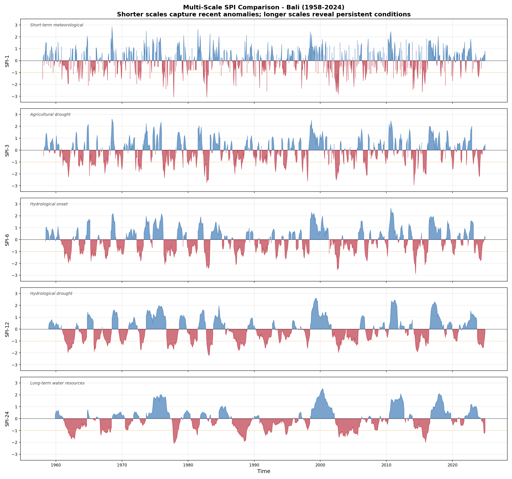
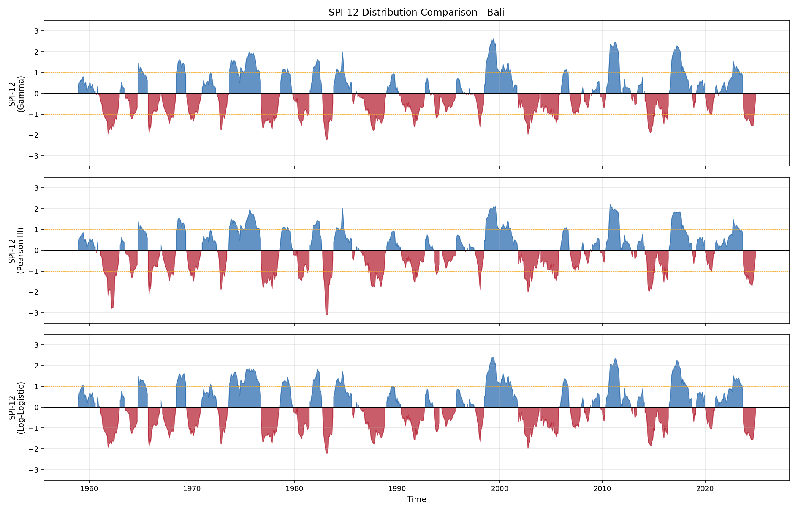
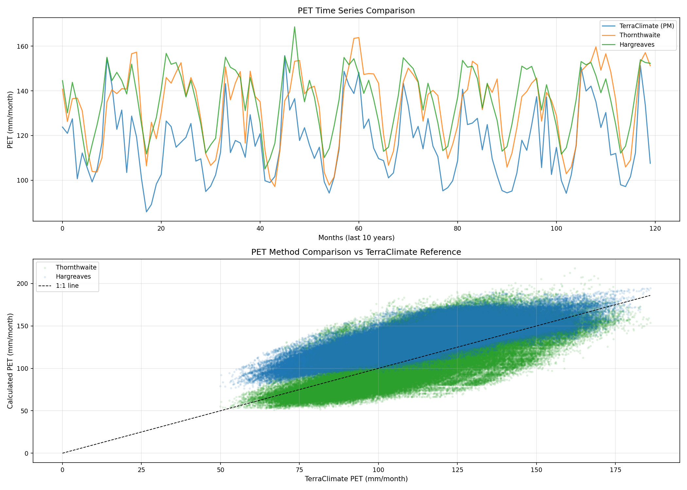
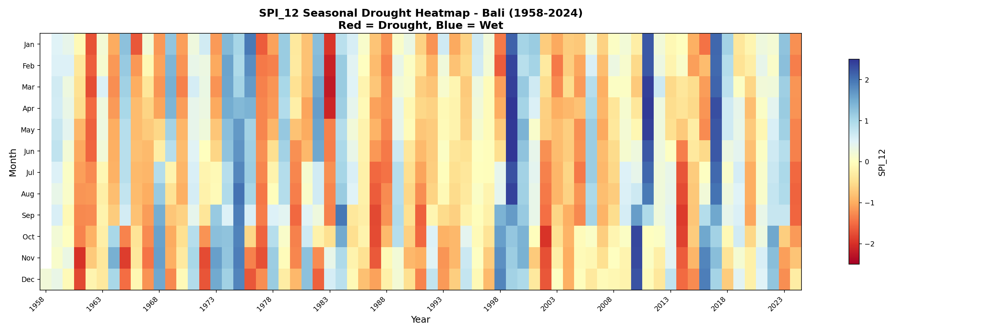
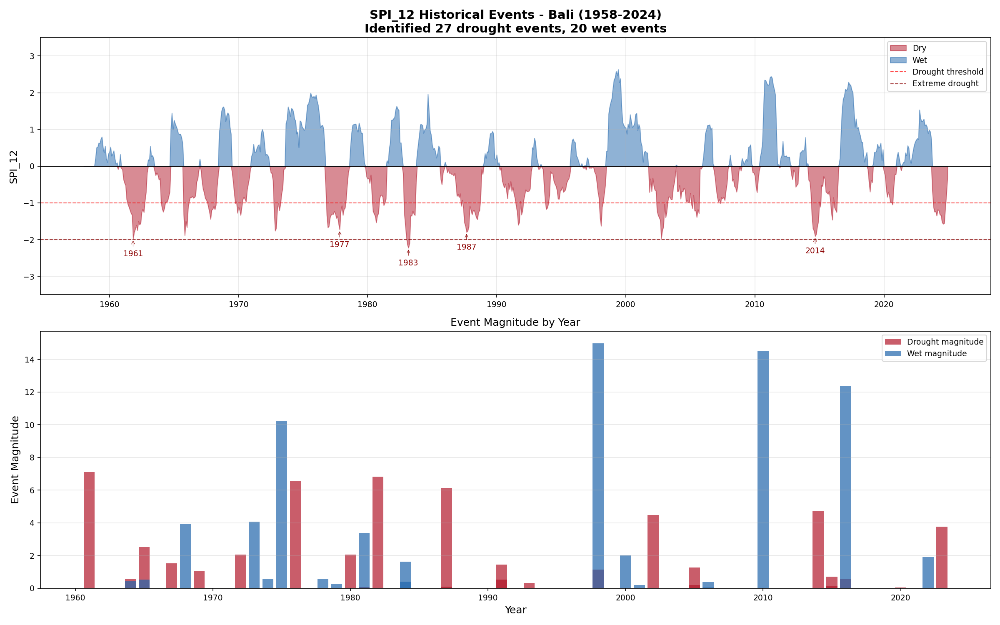
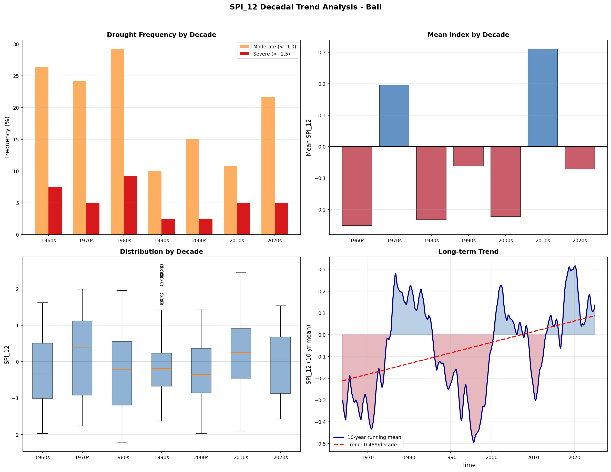
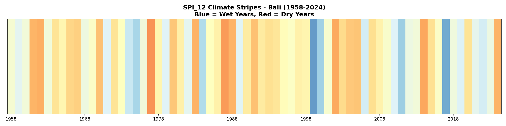
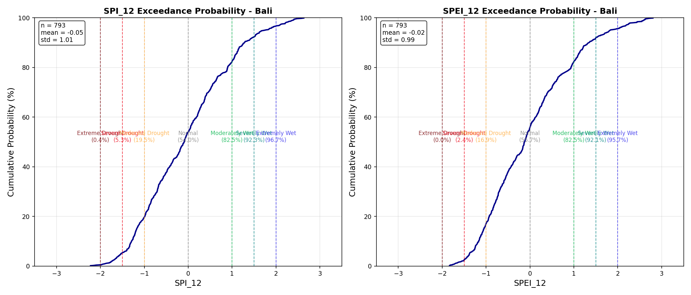
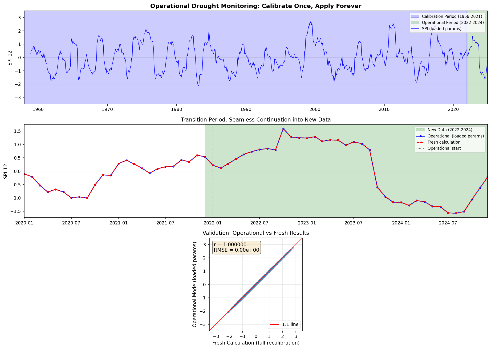

::: {.hero-banner}
::: {.hero-logo}

:::

::: {.hero-content}
# Monitor Climate Extremes with Confidence

A minimal, efficient Python implementation of **Standardized Precipitation Index (SPI)** and **Standardized Precipitation Evapotranspiration Index (SPEI)** for monitoring **both drought and wet conditions** using run theory.

<span class="badge-custom badge-python">Python 3.8+</span>
<span class="badge-custom badge-license">BSD-3-Clause</span>
<span class="badge-custom badge-status">Active Development</span>

[Get Started](get-started/installation.qmd){.btn .btn-primary .btn-lg role="button"}
[View on GitHub](https://github.com/bennyistanto/precip-index){.btn .btn-outline-light .btn-lg role="button"}
:::
:::

---

## Key Features

::: {.grid-container}
::: {.feature-card}
### Climate Indices

- **SPI** — Standardized Precipitation Index
- **SPEI** — Precipitation Evapotranspiration Index
- Multiple time scales (1, 3, 6, 12, 24 months)
- CF-compliant NetCDF output
:::

::: {.feature-card}
### Bidirectional Analysis

- Monitor **drought** (dry conditions)
- Monitor **floods** (wet conditions)
- Unified framework for both extremes
- Consistent methodology
:::

::: {.feature-card}
### Multi-Distribution Support

- **Gamma** — Standard for SPI
- **Pearson III** — Recommended for SPEI
- **Log-Logistic** — Better tail behavior
- Automatic fitting method selection
:::

::: {.feature-card}
### Run Theory Framework

- Event identification & characterization
- Duration, magnitude, intensity, peak
- Time-series monitoring
- Gridded period statistics
:::

::: {.feature-card}
### Scalable Processing

- Memory-efficient spatial tiling
- Process global-scale data (CHIRPS, ERA5)
- Automatic memory estimation
- Streaming I/O for large datasets
:::

::: {.feature-card}
### Visualization Suite

- Time series with event highlighting
- 11-category WMO classification
- Spatial maps of event characteristics
- Distribution comparison charts
:::
:::

---

## Quick Example

```python
import xarray as xr
from indices import spi
from runtheory import identify_events
from visualization import plot_index

# Load precipitation data
precip = xr.open_dataset('precipitation.nc')['precip']

# Calculate SPI-12
spi_12 = spi(precip, scale=12)

# Or use different distributions
spi_12_p3 = spi(precip, scale=12, distribution='pearson3')

# Identify drought events
events = identify_events(spi_12.isel(lat=0, lon=0), threshold=-1.2)

# Visualize
plot_index(spi_12.isel(lat=0, lon=0), threshold=-1.2)
```

---

## What Makes This Package Different?

::: {.callout-note}
## Bidirectional by Design

Unlike traditional drought-only tools, **precip-index** treats dry and wet extremes equally. Use negative thresholds for droughts, positive thresholds for floods — same functions, same methodology.
:::

::: {.callout-tip}
## Multi-Distribution Fitting

Choose the probability distribution that best fits your data. Gamma, Pearson III, and Log-Logistic each use their optimal fitting method — validated to produce correct SPI/SPEI across all grid cells.
:::

::: {.callout-important}
## Run Theory Framework

Goes beyond simple threshold exceedance. Implements full run theory to characterize event duration, magnitude (cumulative & instantaneous), intensity, and peak values.
:::

::: {.callout-note}
## Scalable Architecture

Built for datasets of any size. Small regional grids run in-memory; global datasets (CHIRPS, ERA5, TerraClimate) use chunked processing with automatic spatial tiling and streaming I/O.
:::

::: {.callout-tip}
## Global-Scale Performance

Benchmarked on **CHIRPS v3 global** (0.05° resolution):

- **Dataset:** 2400 × 7200 grid (17.3M cells), 539 months, ~69 GB
- **Processing:** 12 spatial chunks, SPI-12 with Gamma distribution
- **Total time:** ~2 hours 47 minutes on a workstation with 128 GB RAM

Regional subsets (country-level) complete in seconds to minutes.
:::

---

## Validation Results

All distributions tested against TerraClimate Bali data (1958–2024). Cross-distribution correlation exceeds 0.98. The test suite generates **28 visualizations** including advanced analytics and operational mode validation.

::: {.panel-tabset}
### Multi-Scale SPI



SPI at 1-, 3-, 6-, 12-, and 24-month scales. Each captures different drought types: meteorological, agricultural, hydrological, and socioeconomic.

### Distribution Comparison



Three distributions produce consistent SPI-12 time series with correlation > 0.98 between all pairs.

### PET Methods



PET method comparison: Thornthwaite vs Hargreaves vs TerraClimate (Penman-Monteith). Hargreaves correlates better with the reference (r=0.80 vs r=0.75).

### Seasonal Heatmap



Seasonal drought heatmap showing month-by-year patterns. Major droughts (1997, 2015, 2019) appear as vertical red bands.

### Historical Events



Run theory analysis identifies and ranks historical drought/wet events by magnitude.

### Decadal Trends



Long-term analysis showing drought frequency, mean index, and trends by decade.

### Climate Stripes



Climate stripes visualization showing annual drought conditions from 1959-2024. Red = drought years, blue = wet years.

### Exceedance Probability



Risk assessment plot showing probability of exceeding drought thresholds with return period annotations.

### Operational Mode



Parameter persistence for real-time monitoring: calibrate once on historical data, apply consistently to new observations. Results are identical to fresh calculations.
:::

See [Validation & Test Results](technical/validation.qmd) for detailed analysis.

---

## Getting Started

::: {.grid-container}
::: {.feature-card}
### Installation

Install dependencies and clone the repository.

[Install Now](get-started/installation.qmd){.btn .btn-primary}
:::

::: {.feature-card}
### Quick Start

Calculate your first SPI/SPEI in minutes.

[Quick Start](get-started/quick-start.qmd){.btn .btn-primary}
:::

::: {.feature-card}
### Tutorials

Learn through interactive examples with real data.

[View Tutorials](tutorials/01-calculate-spi.qmd){.btn .btn-primary}
:::
:::

---

## Documentation

- **[User Guide](user-guide/index.qmd)** — SPI, SPEI, run theory, and visualization
- **[Technical Docs](technical/index.qmd)** — Methodology, implementation, API reference
- **[Validation](technical/validation.qmd)** — Test results and comparison plots
- **[Changelog](changelog.qmd)** — Version history

---

## Credits

::: {.credits-section}
**Benny Istanto**, GOST/DEC Data Group, The World Bank

Developed to support operational hydrometeorological monitoring — enabling the World Bank to regularly assess extreme dry and wet periods across regions.

Built upon the foundation of [climate-indices](https://github.com/monocongo/climate_indices) by James Adams, with substantial modifications for multi-distribution support, bidirectional event analysis, and scalable processing.
:::

---

## Citation

```bibtex
@software{precip_index_2026,
  author = {Istanto, Benny},
  title = {Precipitation Index: SPI & SPEI for Climate Extremes Monitoring},
  year = {2026},
  url = {https://github.com/bennyistanto/precip-index},
  version = {2026.1}
}
```

---

## Contributing

We welcome contributions! See our [GitHub repository](https://github.com/bennyistanto/precip-index) for bug reports, feature requests, and pull requests.

---

## License

BSD-3-Clause License. See [LICENSE](https://github.com/bennyistanto/precip-index/blob/main/LICENSE) for details.

::: {.callout-warning}
## Active Development

This package is under active development. Please report issues on [GitHub](https://github.com/bennyistanto/precip-index/issues).
:::
