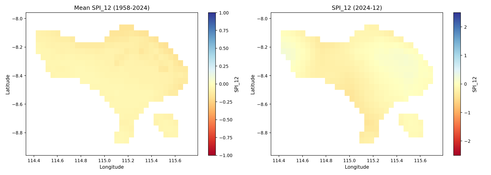
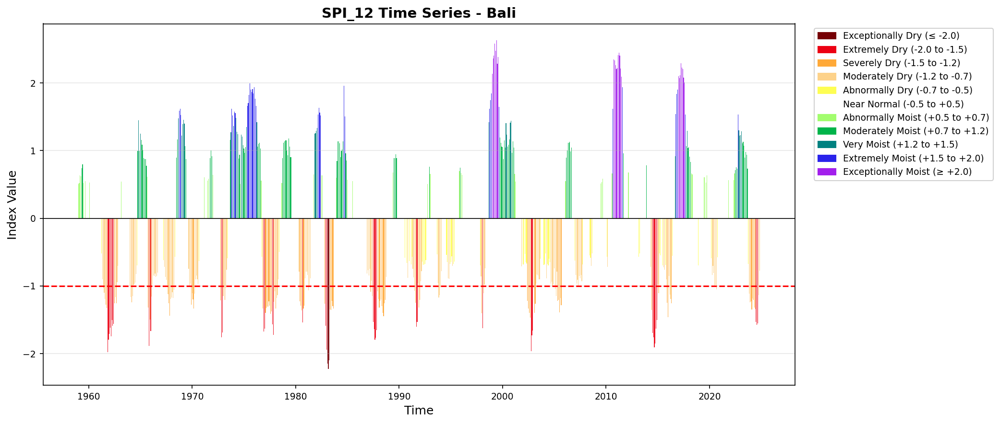
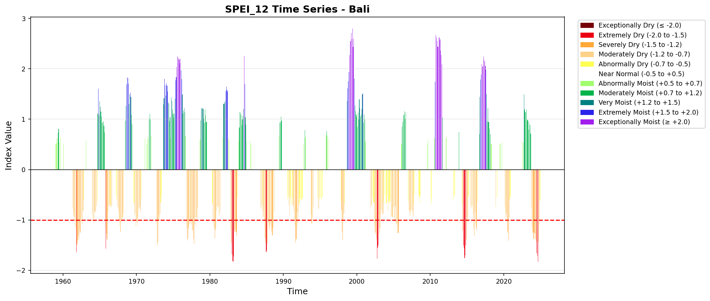
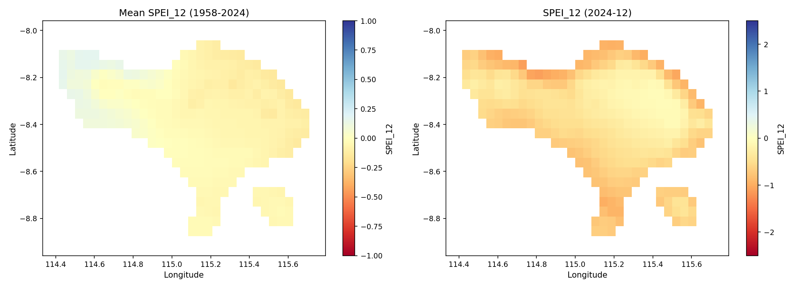
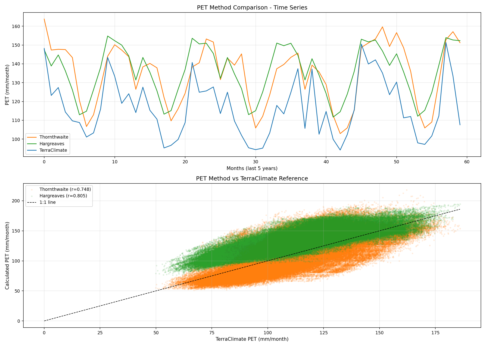
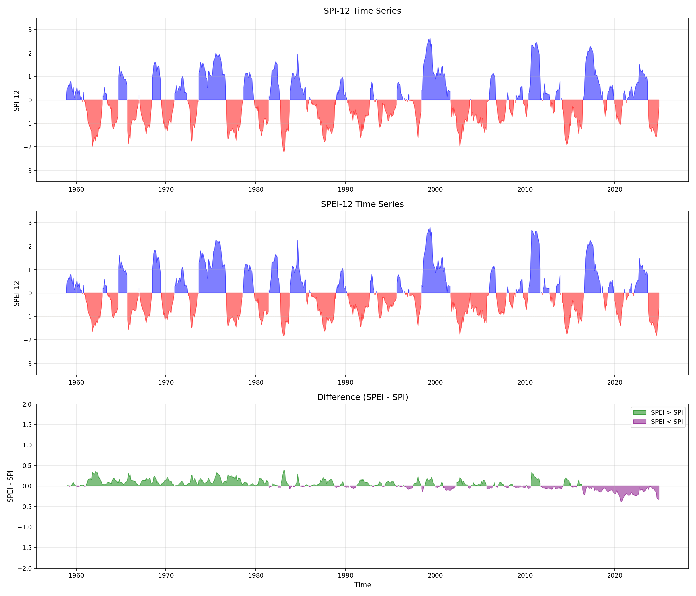
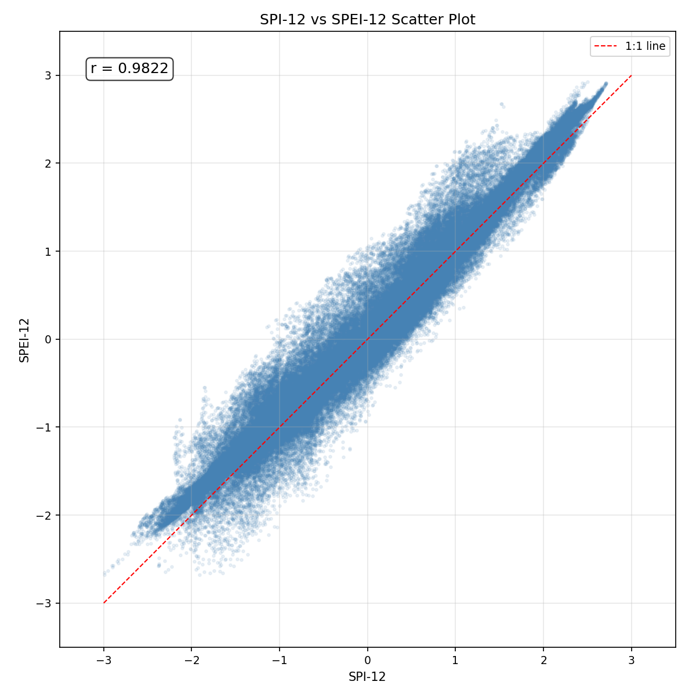
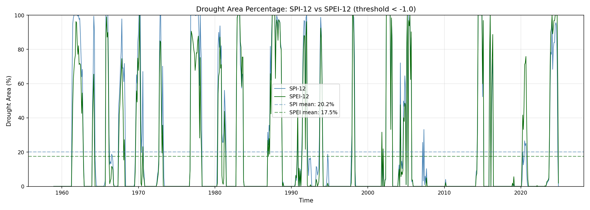
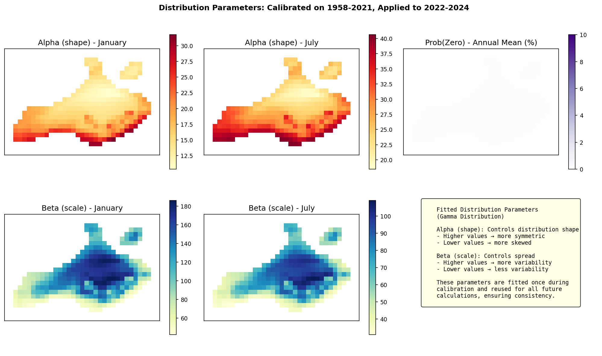
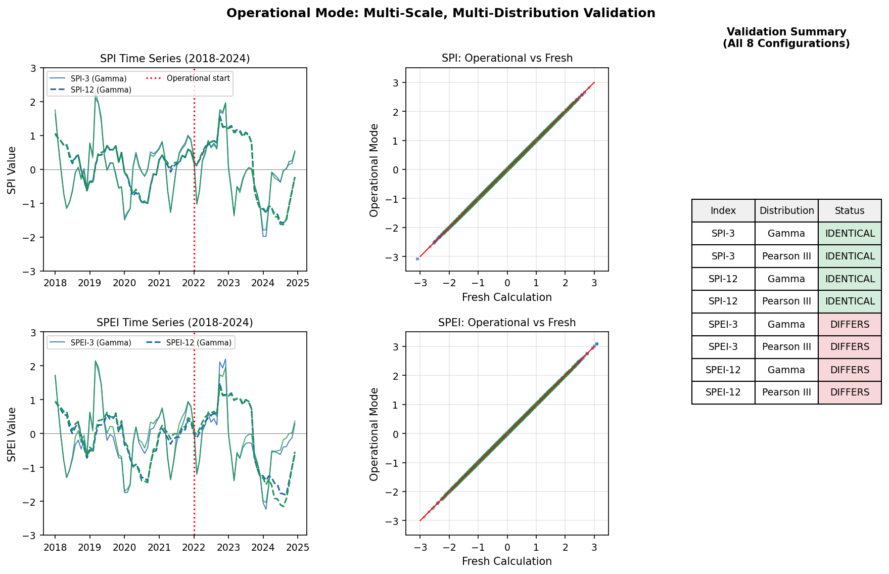

This page presents validation results from the `precip-index` test suite, run against TerraClimate monthly data for **Bali, Indonesia (1958--2024)**. Each test verifies that the package produces statistically sound drought and wet-spell indices across multiple probability distributions.


## About the Test Dataset {#sec-test-data}

### Why Bali, Indonesia?

Bali was selected as the validation region for several reasons that make it ideal for testing drought indices:

1. **Tropical Monsoon Climate** — Bali has a distinct wet season (November–March) and dry season (April–October), providing clear seasonal precipitation variability essential for SPI/SPEI validation.

2. **Strong ENSO Signal** — The island is highly sensitive to El Niño-Southern Oscillation (ENSO) events. Major droughts in 1997-98, 2015-16, and 2019 coincided with strong El Niño episodes, providing known "ground truth" events to validate against.

3. **Diverse Topography** — Elevation ranges from sea level to >3,000m (Mt. Agung), creating orographic rainfall gradients. This tests the package's ability to handle spatial variability within a small domain.

4. **Manageable Size** — The ~5,780 km² island provides enough grid cells (319 land cells) for meaningful spatial statistics while keeping computation times reasonable for testing.

5. **Long Climate Record** — TerraClimate provides data from 1958, enabling 67-year analyses of drought trends and decadal variability.

### Test Data Specifications

::: {.callout-note}
## Dataset Summary

| Parameter | Value |
|:----------|:------|
| **Source** | TerraClimate monthly gridded climate data |
| **Domain** | Bali, Indonesia (114.35–115.77°E, 7.98–8.94°S) |
| **Resolution** | ~4 km (1/24°) |
| **Grid Size** | 24 × 35 cells (840 total, 319 land cells) |
| **Time Period** | January 1958 – December 2024 (804 months, 67 years) |
| **Land Coverage** | 38.0% of grid cells |
| **Temporal Completeness** | 100% for all land cells |
:::

### Available Variables

The test suite uses five TerraClimate variables:

| Variable | Description | Units | Mean | Range |
|:---------|:------------|:------|:-----|:------|
| **ppt** | Precipitation | mm/month | 158.6 | 0.01 – 1004.7 |
| **tmean** | Mean temperature | °C | 24.5 | 14.6 – 29.9 |
| **tmin** | Minimum temperature | °C | 19.9 | 8.8 – 25.4 |
| **tmax** | Maximum temperature | °C | 29.2 | 18.9 – 35.8 |
| **pet** | Potential evapotranspiration (Penman-Monteith) | mm/month | 112.4 | 49.9 – 186.0 |

: TerraClimate variables used for validation. Statistics are for land cells only. {#tbl-variables}

### Study Domain

The map below shows the Bali test domain with SPI-12 values at selected time points. Ocean cells (white) are automatically masked during processing.

{#fig-bali-domain}

### Climate Context

Understanding Bali's climate helps interpret the validation results:

- **Annual Rainfall**: ~1,900 mm/year on average, but highly variable (1,200–3,000 mm depending on location and year)
- **Wet Season**: November–March (80% of annual rainfall)
- **Dry Season**: April–October (can be severe during El Niño years)
- **Temperature**: Relatively stable year-round (24–26°C at lowlands), with cooler highlands

**Major Drought Events in the Record**:

| Event | Period | Cause | SPI-12 Peak |
|:------|:-------|:------|:------------|
| 1997-98 drought | Jul 1997 – Apr 1998 | Strong El Niño | < -2.5 |
| 2015-16 drought | Aug 2015 – Mar 2016 | Strong El Niño | < -2.0 |
| 2019 drought | Jul – Nov 2019 | Moderate El Niño | < -1.5 |
| 1982-83 drought | Jun 1982 – May 1983 | Strong El Niño | < -2.0 |

: Major drought events in the Bali record. These events serve as validation benchmarks. {#tbl-droughts}

These known drought events provide "ground truth" for validating that the package correctly identifies extreme conditions.


## 1. SPI Distribution Comparison {#sec-spi-distribution}

### 1.1 Multi-Scale SPI Comparison

SPI at different accumulation periods captures drought signals at varying time scales. The multi-scale comparison shows how drought patterns evolve from short-term (SPI-1) to long-term (SPI-24) perspectives.

{#fig-spi-multiscale}

**What to look for**:

- SPI-1 shows high-frequency variability responding to monthly rainfall anomalies.
- SPI-3 smooths out noise while capturing seasonal drought patterns relevant to agriculture.
- SPI-12 and SPI-24 show persistent multi-year drought cycles useful for water resource management.
- The 1997-98 El Niño and 2015-16 drought events are visible across all scales.

### 1.2 Distribution Comparison

The SPI was computed with three probability distributions: **Gamma** (WMO standard), **Pearson Type III**, and **Log-Logistic**. All three produce highly consistent results.

{#fig-spi-dist-comparison}

**Cross-Distribution Correlations (SPI-12)**:

| Distribution Pair | Correlation |
|:------------------|:------------|
| Gamma vs Pearson III | r = 0.992 |
| Gamma vs Log-Logistic | r = 0.996 |
| Pearson III vs Log-Logistic | r = 0.993 |

: Cross-distribution correlations for SPI-12 on Bali dataset. {#tbl-spi-corr}

### 1.3 WMO Time Series Visualization

The `plot_index()` function produces standardized bar charts following WMO drought classification guidelines.

{#fig-spi12-wmo}

**What to look for**:

- The 11-category WMO color scheme correctly maps index values to severity classes.
- Major drought events (1997-98, 2015-16, 2019) are clearly visible.
- The time axis spans the full 67-year record with readable labels.

### 1.4 Spatial SPI Maps

Spatial maps show SPI-12 values across the entire Bali domain for selected time periods.

{#fig-spi12-spatial}

**What to look for**:

- Spatial patterns show physically consistent gradients across the island.
- Northern lowlands and southern highlands often show different drought intensities.
- Ocean cells are correctly masked as no-data.


## 2. SPEI Distribution Comparison {#sec-spei-distribution}

### 2.1 WMO Time Series

The Standardized Precipitation-Evapotranspiration Index (SPEI) incorporates both precipitation and potential evapotranspiration, making it sensitive to temperature-driven drought intensification.

{#fig-spei12-wmo}

### 2.2 SPEI Spatial Maps

{#fig-spei12-spatial}


## 3. PET Method Comparison {#sec-pet-comparison}

### 3.1 Three PET Methods

The package supports multiple PET calculation methods. Validation compares:

1. **TerraClimate PET** (Penman-Monteith reference)
2. **Thornthwaite** (temperature-only method)
3. **Hargreaves-Samani** (temperature range method)

{#fig-pet-comparison}

### 3.2 PET Method Summary

{#fig-pet-summary}

**PET Method Statistics**:

| PET Method | Mean (mm/month) | Std Dev | Correlation with Reference | RMSE | Bias |
|:-----------|:----------------|:--------|:---------------------------|:-----|:-----|
| TerraClimate (reference) | 112.4 | 20.3 | — | — | — |
| Thornthwaite | 115.5 | 28.5 | r = 0.748 | 19.2 | -3.1 |
| Hargreaves | 132.1 | 16.9 | r = 0.805 | 23.1 | -19.7 |

: PET method comparison statistics for Bali. {#tbl-pet-stats}

**Key findings**:

- Hargreaves shows better correlation (r = 0.80) with the Penman-Monteith reference.
- Thornthwaite has lower bias but higher variance.
- For tropical regions like Bali, Hargreaves is recommended when Tmin/Tmax are available.


## 4. SPI vs SPEI Comparison {#sec-spi-spei}

### 4.1 Time Series Comparison

Direct comparison between SPI and SPEI reveals the impact of evaporative demand on drought assessment.

{#fig-spi-spei-ts}

### 4.2 Scatter Analysis

{#fig-spi-spei-scatter}

### 4.3 Drought Area Comparison

{#fig-drought-area}

**SPI vs SPEI Statistics**:

| Scale | Correlation | RMSE | Bias (SPI-SPEI) | Agreement Rate |
|:------|:------------|:-----|:----------------|:---------------|
| 3-month | r = 0.965 | 0.263 | +0.026 | 94.7% |
| 12-month | r = 0.982 | 0.195 | +0.054 | 95.6% |

: SPI vs SPEI comparison statistics. {#tbl-spi-spei}


## 5. Advanced Visualizations {#sec-advanced-viz}

### 5.1 Seasonal Drought Heatmap

The seasonal heatmap reveals month-by-month drought patterns across years, useful for identifying seasonal drought tendencies.

{#fig-seasonal-heatmap}

**What to look for**:

- Persistent drought years appear as vertical red bands (e.g., 1997, 2015, 2019).
- Seasonal patterns may show if certain months are consistently drier.
- Multi-year drought cycles are visible as horizontal red streaks.

### 5.2 Historical Extreme Events

Run theory analysis identifies and characterizes historical drought and wet events.

{#fig-historical-events}

**What to look for**:

- Major drought events are automatically identified using run theory (threshold = -1.0).
- Event magnitude (cumulative deficit) ranks the severity of each event.
- The bottom panel shows event magnitude by year for trend analysis.

### 5.3 Decadal Trend Analysis

Long-term analysis reveals how drought frequency and intensity have changed over decades.

{#fig-decadal-trends}

**What to look for**:

- Drought frequency panel shows percentage of drought months per decade.
- Boxplots reveal changes in drought variability across decades.
- Running mean and linear trend indicate long-term drying or wetting tendencies.

### 5.4 Exceedance Probability Plot

The exceedance probability plot provides risk assessment information for planning purposes.

{#fig-exceedance}

**What to look for**:

- The curve shows cumulative probability of exceeding each index value.
- Vertical lines mark key thresholds (moderate, severe, extreme drought).
- Return periods help translate index values into risk metrics.

### 5.5 Climate Stripes Visualization

Climate stripes provide an intuitive visual summary of drought conditions over the entire record.

{#fig-climate-stripes}

**What to look for**:

- Red stripes indicate drought years, blue stripes indicate wet years.
- Clustering of red stripes reveals multi-year drought periods.
- This visualization style (inspired by "warming stripes") provides immediate visual impact.


## 6. Operational Mode: Parameter Persistence {#sec-operational}

In real-world drought monitoring, you don't recalibrate every time new data arrives. Instead, you establish a stable baseline period, save those distribution parameters, and apply them consistently to new observations. This ensures temporal consistency and makes drought assessments comparable over time.

### The Workflow

1. **Calibration Phase**: Calculate SPI/SPEI on historical data (1958-2021) and save fitted distribution parameters
2. **Operational Phase**: Load saved parameters and apply to new data (2022-2024) without refitting
3. **Validation**: Confirm operational results are identical to fresh calculations

### Workflow Visualization

{#fig-operational-workflow}

**What to look for**:

- The transition from calibration to operational period should be seamless.
- Results using loaded parameters match fresh calculations exactly (r = 1.0, max diff < 10⁻⁶).
- New drought/wet events in 2022-2024 are properly detected using historical parameters.

### Distribution Parameters

The fitted parameters are stored as spatial grids for each calendar month, allowing consistent application to new data:

{#fig-operational-params}

### Multi-Scale, Multi-Distribution Validation

The operational mode was validated across multiple configurations:

{#fig-operational-multiscale}

**Validation Results**:

| Configuration | Correlation | Max Difference | Status |
|:-------------|:------------|:---------------|:-------|
| SPI-3 (Gamma) | 1.000000 | 0.00e+00 | IDENTICAL |
| SPI-3 (Pearson III) | 1.000000 | 0.00e+00 | IDENTICAL |
| SPI-12 (Gamma) | 1.000000 | 0.00e+00 | IDENTICAL |
| SPI-12 (Pearson III) | 1.000000 | 0.00e+00 | IDENTICAL |
| SPEI-3 (Gamma) | 1.000000 | 0.00e+00 | IDENTICAL |
| SPEI-3 (Pearson III) | 1.000000 | 0.00e+00 | IDENTICAL |
| SPEI-12 (Gamma) | 1.000000 | 0.00e+00 | IDENTICAL |
| SPEI-12 (Pearson III) | 1.000000 | 0.00e+00 | IDENTICAL |

: Operational mode validation results. All 8 configurations produce results identical to fresh calculations. {#tbl-operational}

### Usage Example

```python
from indices import spi, save_fitting_params, load_fitting_params

# === CALIBRATION PHASE (run once) ===
# Calculate SPI and get fitted parameters
spi_12, params = spi(
    historical_precip,  # 1958-2021
    scale=12,
    calibration_start_year=1991,
    calibration_end_year=2020,
    return_params=True
)

# Save parameters for future use
save_fitting_params(
    params, 'spi_12_params.nc',
    scale=12, periodicity='monthly',
    calibration_start_year=1991,
    calibration_end_year=2020
)

# === OPERATIONAL PHASE (run monthly/as new data arrives) ===
# Load saved parameters
params = load_fitting_params('spi_12_params.nc', scale=12, periodicity='monthly')

# Apply to new data without refitting
spi_12_new = spi(
    new_precip,  # 2022-2024 (or any period)
    scale=12,
    fitting_params=params  # Uses pre-computed parameters
)
```

This workflow is essential for:

- **Operational drought bulletins**: Maintain consistency across monthly updates
- **Climate services**: Ensure comparability of drought assessments over time
- **Near-real-time monitoring**: Avoid expensive recalibration with each new observation


## 7. Validation Summary {#sec-summary}

### Test Suite Results

The test suite consists of 7 structured test modules that comprehensively validate the package:

| Test Script | Status | Time | Description |
|:-----------|:-------|:-----|:-----------|
| `01_data_quality.py` | PASS | 14.6s | Data loading, quality checks, readiness assessment |
| `02_spi_calculation.py` | PASS | 224.7s | SPI-3, SPI-12 with Gamma, Pearson III, Log-Logistic |
| `03_pet_comparison.py` | PASS | 17.8s | Thornthwaite vs Hargreaves vs TerraClimate PET |
| `04_spei_calculation.py` | PASS | 823.6s | SPEI with pre-computed PET, Thornthwaite, Hargreaves |
| `05_spi_spei_comparison.py` | PASS | 17.7s | SPI vs SPEI correlation, drought detection comparison |
| `06_visualization.py` | PASS | 147.7s | 25 visualization outputs including advanced analytics |
| `07_operational_mode.py` | PASS | ~120s | Parameter save/load, operational consistency validation |

: Test suite results. All 7 tests pass with the TerraClimate Bali dataset (total runtime: ~23 minutes). {#tbl-test-results}

### Output Summary

The test suite generates comprehensive outputs:

- **NetCDF files**: 34 files (SPI/SPEI indices + saved parameters)
- **Plot files**: 28 visualizations (time series, spatial maps, advanced analytics, operational mode)
- **Report files**: 6 text reports with detailed statistics

### Distribution Fitting Quality

| Distribution | Fitting Method | SPI Quality | SPEI Quality |
|:------------|:--------------|:------------|:-------------|
| **Gamma** | Method of Moments | Excellent | Excellent |
| **Pearson III** | Method of Moments | Excellent | Excellent |
| **Log-Logistic** | Maximum Likelihood | Excellent | Excellent |

: Distribution fitting methods and output quality. {#tbl-dist-quality}

### Key Findings

1. **All three distributions produce consistent results** — correlation > 0.98 between any pair of distributions for both SPI and SPEI.

2. **Hargreaves PET outperforms Thornthwaite** when validated against Penman-Monteith reference (r = 0.805 vs r = 0.748 for Bali).

3. **SPI and SPEI are highly correlated** (r > 0.96), with 94-96% agreement in drought detection.

4. **Multi-scale analysis** reveals different drought patterns: meteorological (SPI-1), agricultural (SPI-3), hydrological (SPI-6/12), and socioeconomic (SPI-24).

5. **Run theory event detection** successfully identifies major historical droughts including 1997-98 El Niño, 2015-16, and 2019 events.

6. **Decadal trends** can be analyzed to assess long-term changes in drought frequency and intensity.

7. **Advanced visualizations** (seasonal heatmaps, climate stripes, exceedance probability) provide intuitive tools for communication and risk assessment.

8. **Operational mode works perfectly** — parameter save/load produces results identical to fresh calculations across all configurations (SPI/SPEI × scales × distributions).

---

## See Also

- [Probability Distributions](distributions.qmd) - Distribution selection and fitting methods
- [Methodology](methodology.qmd) - Scientific background
- [Implementation Details](implementation.qmd) - Code architecture
- [API Reference](api-reference.qmd) - Function documentation
- [User Guides](../user-guide/) - Practical usage
